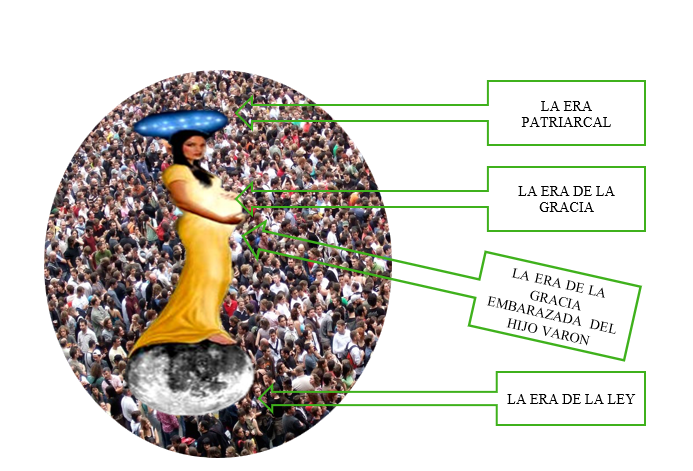

# Salvos de la Iglesia Universal

> **Col 1:20** Y por medio de El reconciliar todas las cosas consigo, habiendo hecho la paz por medio de la sangre de su cruz, por medio de Él, repito, ya sean las que están en la tierra o las que están en los cielos.

Para poder ensenar los últimos tiempos lo primero que debemos debemos hacer es ubicarnos en contexto de los tiempos finales que nos a tocado vivir 1 Cor 10:11 Américas.

Y para entender esto tenemos que estudiar el macrocosmos o macro esquema escatológico, que narra y marca puntualmente la biblia de los hijos de Dios.

Los cuales estamos interesados en nuestro destino final Efe 1:10. y que gracias a su gran misericordia que es mas alta que los cielos salmo 3:11, nos invita a llegar a ese glorioso momento en el cual nos van a galardonar siendo la reina del cielo o esposa de cordero, aunque la base bíblica el pie de imprenta la encontramos en la biblia es por el lado negativo, pero si existe el lado negativo, existe el verdadero. Jeremías 7:18, esto quiere decir que en el cielo hubo, hay o abra una reina del cielo.

Por lo cual empezamos nuestro estudio desde el cosmos lo mas grande, para estudiar quien en son estos hombres y mujeres que serán dignos de este glorioso galardona miento de ser reina de los cielos eternamente, que empieza con nuestro mismo Jesucristo cuando se aparezca a nuestras vidas en su parusías o manifestación secreta apo 22;12. En este recorrido descenderemos de lo macro a lo micro en un viaje a través de las escrituras que es fascinante y glorioso descubriendo y al mismo tiempo revelándonos a nuestro ser trino 1 Tes 5:23 si podemos ser de esta elite que es la novia esposa de hoy en día que en un futuro será la cena del cielo.

Al mismo tiempo veremos en este recorrido las cosas inamovibles para nuestra doctrina (Elim) veremos también lo inamovible para nuestra doctrina Elim, aunque pueda suceder que tengamos diferencia en el micro esquema, pero creemos que nuestro Dios de la gloria no irá revelando a cado uno como ministros de a Dios para que lleguemos a la unidad del conocimiento pleno del Hijo de Dios Efesios 4:13.
Por último, vale la pena perseverar y consagrarnos para ser protagonista de todo esto.

