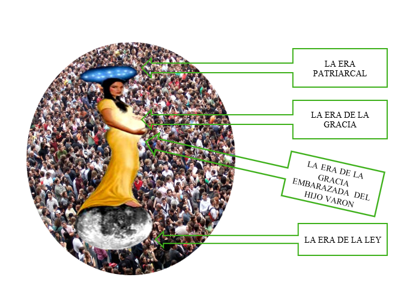

--- 
title: "SALVOS DE LA IGLESIA UNIVERSAL DE TODOS LOS TIEMPOS"
author: "Ministerios Elim - Los Ángeles"
date: "`r Sys.Date()`"
site: bookdown::bookdown_site
output: bookdown::gitbook
documentclass: book
bibliography: [book.bib, packages.bib]
biblio-style: apalike
link-citations: yes
github-repo: rstudio/bookdown-demo
description: "Primer libro virtual sobre la Doctrina Elim - Ministerios Elim"
---

# Salvos de la Iglesia Universal

> **Col 1:20** Y por medio de Él reconciliar todas las cosas consigo, habiendo hecho la paz por medio de la sangre de su cruz, por medio de Él, repito, ya sean las que están en la tierra o las que están en los cielos.

Este es un estudio doctrinal sobre la Iglesia en todos los tiempos, desde una perspectiva universa.

